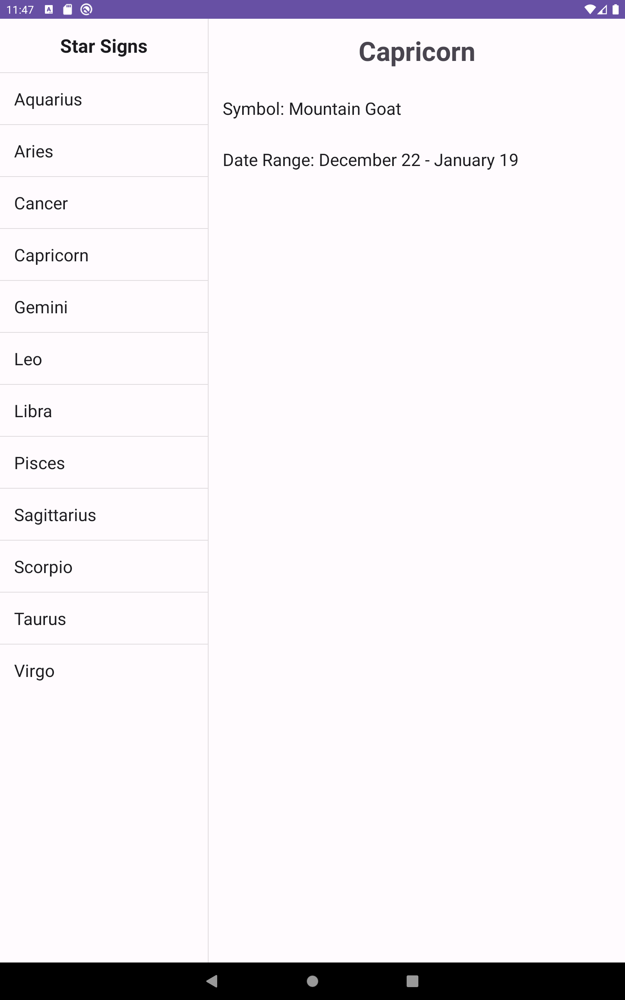
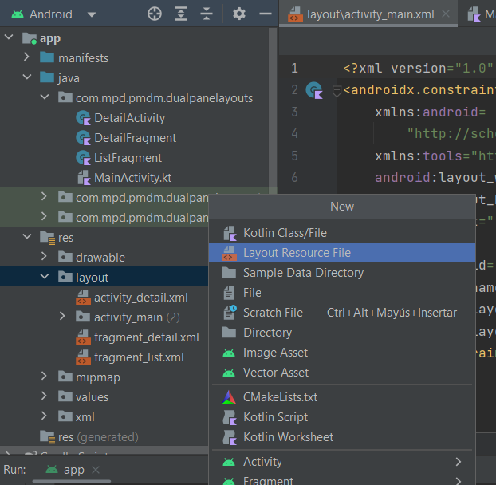
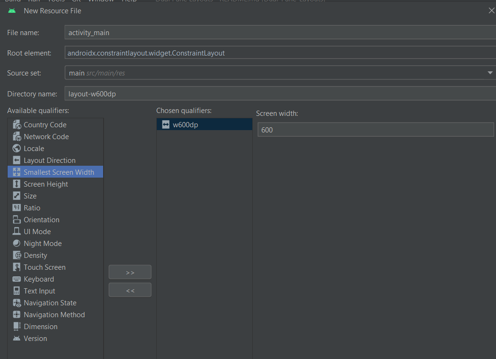

# DualPaneLayouts

Ejemplo del uso de fragmentos para mostrar la implementación de paneles duales en pantallas grandes, usando fragmentos estáticos que se comunican entre ellos

Se trata de una aplicación que muestra una lista de signos del zodicado, y al hacer click en uno de ellos, muestra el detalle de dicho signo. 


1. Si la aplicación se ejecuta en una pantalla de tamaño normal, entonces se cargará el diseño con un único fragmento, y al hacer click en un signo, carga otra actividad (DetailActivity) que contiene el otro fragmento mediante un intent explícito. 
2. Para aprovechar pantallas grandes en dispositivos como tabletas, la actividad principal contiene directamente ambos fragmentos. En este caso no se usa la actividad DetailActivity para nada, ya que los dos fragmentos que nos interesan están presentes en la activity_main cargada.

   Por ejemplo, en una tablet Nexus 10:

    

En el activity_main por defecto sólo hay un fragment, pero se añade un layout adicional para usar con pantallas grandes

Esto se hace desde la vista Android del proyecto, sobre res/layout  seleccionamos New->Layout Resource File

 - En la ventana que se muestra, podemos añadir un layout con el  mismo nombre activity_main, pero seleccionamos la propiedad "Smallest Screen Width" y le damos un valor de 600. Así, este layout se aplicará automáticamente en pantallas con al menos 600dp de ancho:

 - Este layout adicional tiene dos fragment en lugar de uno. Así sacamos provecho de su espacio adicional. 

De este modo, tendremos dos layouts, controlados ambos desde el mismo _MainActivity.kt._

En este proyecto se puede observar una forma de comunicar distintos fragmentos entre sí (para el caso de la tableta) siguiendo el [patrón observador](https://wiki.yowu.dev/es/Knowledge-base/Kotlin/Learning/063-the-observer-pattern-in-kotlin-implementing-the-observer-design-pattern):  
 - Definimos una interface StarSignListener, que simplemente tiene una función que hace de Listener u observador. En este caso se define directamente en el archivo MainActivity.kt aunque se podría definir en un archivo aparte. Esta interface está diseñada para que la Actividad padre de los fragmentos la implemente, y así haga de observador de cualquier cambio de estado del fragmento y pase la info necesaria al hacer click en algún elemento del primer fragmento, al segundo:
```
interface StarSignListener{
    /**
     * Cuando se selecciona un signo del zodiaco en ListFragment
     * se llama a la implementación de este método
     */
    fun onSelected(id: Int)
}
```
 - Nuestra clase MainActivity implementa esta interface, y por tanto, está obligada a dar implementación a ese método. En dicha implementación define lo que debe hacer si se trata de un panel dual (una actividad con dos fragmentos) o si se trata de la versión con dos actividades. (Fijaros cómo se asigna valor a isDualPane en la función onCreate()):
```
override fun onSelected(id: Int) {
    if(isDualPane){
        val detailFragment = supportFragmentManager
            .findFragmentById(R.id.star_sign_detail) as DetailFragment
        //Pasamos el id, que nos viene desde el ListFragment, a la función de DetailFragment
        detailFragment.setStarSignData(id)
    } else {
        val detailIntent = Intent(this, DetailActivity::class.java)
        detailIntent.putExtra(STAR_SIGN_ID, id)
        startActivity(detailIntent)
    }
}
```
 - Como podéis ver, en el caso del panel dual, se localiza un fragmento que ya está cargado a través del supportFragmentManager, con su función findFragmentById, y se castea para que sea una instancia del DetailFragment y poder usar sus funciones. 
 - Seguidamente se llama la función setStarSignData de la instancia de DetailFragment, que lo que hace es simplemente asignar los valores correspondientes al signo pulsado en los atributos de sus View (todos de tipo TextView).

Con esto ya tenemos lista nuestra MainActivity el DetailFragment para comunicarse, pero falta ver cómo se genera la llamada a la función implementada de la interface desde el ListFragment.
En ListFragment:
 - Definimos un atributo para almacenar la referencia al Listener que usaremos para pasarle los clicks en los elementos del listado:
```
//Nos comprometemos a iniciarlo
private lateinit var starSignListener: StarSignListener
```
 - Lo inicializamos en onAttach(), justo cuando el fragmento se añade a su Actividad correspondiente.
```
 override fun onAttach(context: Context) {
     super.onAttach(context)
     if(context is StarSignListener){
         starSignListener = context
     } else{
       throw RuntimeException("Must implement StarSignListener")
     }
     //Valdría también lo siguiente
//        if(activity is StarSignListener){
//            starSignListener = activity as StarSignListener
//        }
 }
```
 - En onViewCreated, cuando ya tenemos nuestra jerarquía de vistas disponible, asociamos a cada View signo (que previamente hemos introducido en una lista, para ahorrar código), en su setOnClickListener, el listener correspondiente que hemos inicializado antes:
```
starSigns.forEach{
   it.setOnClickListener{
       starSignListener.onSelected(it.id)
   }
}
```

Con esto, y tras añadir el código correspondiente para navegación entre Actividades para pantallas normales, ya tendremos nuestra aplicación de panel dual funcional.


